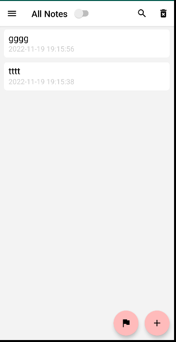

# NotePad

## 只做到了简单的添加时间戳和搜索功能

### 一、主页面
# 
### 二、笔记
# 
# 主页增加新的note
# 
# 删除
# 
# 界面
# 
### 三、搜索
# 
# （1）在noteslist_item.xml的布局文件中增加一个TextView来显示时间戳
# <TextView
#       android:id="@+id/text2"
#        android:layout_width="match_parent"
#       android:layout_height="wrap_content"
#        android:gravity="right"
#        android:paddingLeft="5dip"
#        android:textAppearance="?android:attr/textAppearanceSmall"
#        android:textColor="@color/lightsalmon" />
# （2）数据库中已有文本创建时间和修改时间连个字段
#  选取修改时间这一字段，并将其格式化存入数据库
# （3）然后在NotesList的数据定义中增加修改时间
#  新增一行【NotePad.Notes.COLUMN_NAME_MODIFICATION_DATE,】//在这里加入了修改时间的显示
# （4）新建一个布局文件list_options_menu.xml，添加一个搜索的item
# （5）在NoteList中加搜索的case语句
#    case R.id.menu_search:
#    Intent intent = new Intent();
#    intent.setClass(NotesList.this,NoteSearch.class);
#    NotesList.this.startActivity(intent);
#    return true;
# （6）新建布局文件note_search_list.xml
# （7）新建一个名为NoteSearch的java文件
# （8）在AndroidManifest.xml注册NoteSearch
#  <activity
#        android:name="NoteSearch"
#        android:label="@string/title_notes_search">
#  </activity>
